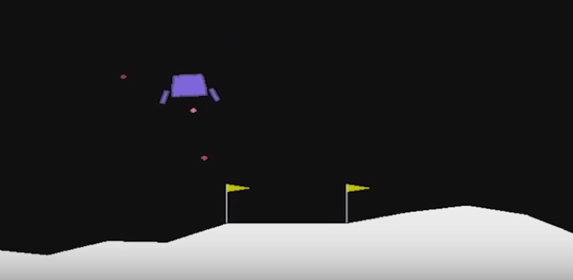

# DRL_LUNAR_LANDER

Navigation project: Train an agent via a deep reinforcement algorithm to complete a navigation task.

For an introduction to reinforcement learning and deep reinforcement learning in particular as a applied to a similar training problem, we refer to [Cartpole - Introduction to Reinforcement Learning (DQN - Deep Q-Learning)](https://towardsdatascience.com/cartpole-introduction-to-reinforcement-learning-ed0eb5b58288).

### Introduction

<p align="center">
  
</p>

In this project we train an agent to land a lunar lander.

The [specification of the environment](http://gym.openai.com/envs/LunarLander-v2/) reads as:
The landing pad is always at the coordinates (0,0). The coordinates are the first two given numbers in a state vector. The reward for moving from the top of the screen to the landing pad and zero speed is about 100 to 140 points. If the lander moves away from landing pad, it obtains negative reward. An episode finishes if the lander crashes or comes to rest, receiving additional -100 or +100 points. For each leg getting ground contact the lander obtains +10. Firing the main engine yields -0.3 points for each frame! The environment is solved if 200 points are reached. Four discrete actions are available: do nothing, fire left orientation engine, fire main engine, fire right orientation engine.

For completeness, we give the gym details of the environment:

```
State shape:  (8,)
Number of actions:  4
```
### Getting Started

To run the environment the **gym** package has to be installed.

Computations were done using python 3.7. In addition, the following packages were mounted: **matplotlib**, **numpy**, **torch**.

### Instructions

The project can be run by starting the Deep_Q_Network.py file. This main file calls the learning agent and the neural network which are saved in `dqn_agent.py` and `model.py`, respectively. Results of the analysis are collected in the `report.md` file.

## License
This repository is licensed under the MIT License.
